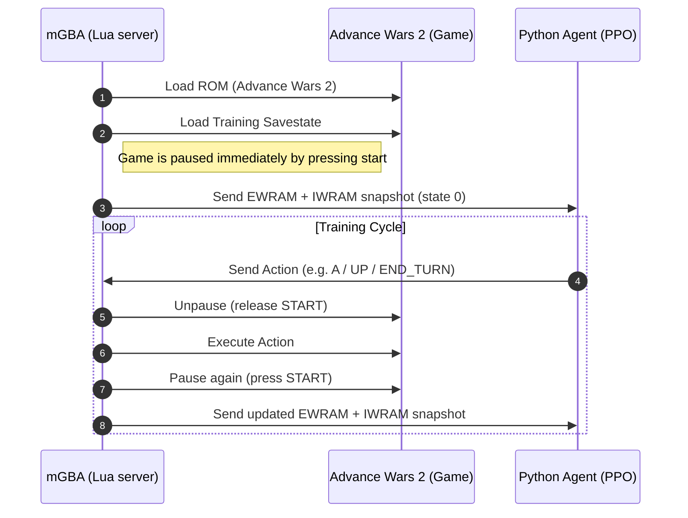

# ADVANCE WARS 2 - PPO

This is a project to train a model to play AW2 on Game Boy Advance using Proximal Policy Optimization.

## State of the project

I started the project using [stable-retro](https://github.com/Farama-Foundation/stable-retro) but it was not reliable enough on the memory side of the GBA which make it a lot harder to train the model.
I looked at the emulator [mgba](https://github.com/mgba-emu/mgba) that has two ways to interact with code:
- Python bindings: They are deprecated [Issue #2773](https://github.com/mgba-emu/mgba/issues/2773).
- Lua server: I can look at the memory and i can send command(s) to execute from python. I just need to look if the memory part looks good.

There is also a few problems from the lua socket reimplementation in mgba, there is no way for the moment to make a server that will wait for an action to execute it and run the next(s) frame(s). The workaround, that i am trying now, will be to use in-game pause by pressing start to make it wait while PPO is computing result of the action like this:

I hope that it will go well :).

### Author

**Amory Hervet**  
Student at **EPITA**, specialization in *Cognitive Science & Advanced Computing (SCIA-G)*.  
[amory.rv@gmail.com](mailto:amory.rv@gmail.com) · [LinkedIn](https://www.linkedin.com/in/amory-hervet/)
